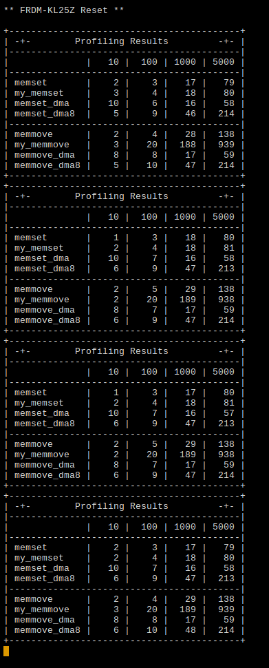

# ECEN5813 Project 3 Profiling Report

 - [Summary](#Summary)
 - [Results](#Results)
 - [Screenshots](#Screenshots)

## Summary

The various memory functions implementations were profiled for both the
FRDM-KL25Z and the BeagleBone Black platforms. The following functions were tested:

  - Set a region of memory to a value
    - `memset` : Standard C library version
    - `my_memset` : CPU-based writes
    - `my_memset_dma` : DMA-based, optimized with 16/32 bit transfers (KL25Z only)
    - `my_memset_dma8` : DMA-based, only 8-bit transfers (KL25Z only)
  - Move a region of memory to another region
    - `memmove` : Stanard C library version
    - `my_memmove` : CPU-based writes
    - `my_memmove_dma` : DMA-based, optimized with 16/32 bit transfers (KL25Z only)
    - `my_memmove_dma8` : DMA-based, only 8-bit transfers (KL25Z only)

The entire set of tests was compiled both with (`-O3`) and without (`-O0`)
optimizations, and run 4 times to account for any variance at runtime.

In short, the C library versions are quite performant, with minimal overhead and
good set/transfer rates. They do not improve significantly with optimization
enabled as the library is precompiled.

All of the custom functions show a significant benefit from optimization. The
overhead is significantly reduced, which can be seen in the small
transfers/sets. The CPU-driven large sets/transfer also benefit from
optimization, reducing execution time somewhere inside the major loops.

The DMA functions clearly have move overhead, and are actually slower than even
unoptimized small transfers. However, the benefit for large transfers is clear,
and using 16/32 when possible shows that they can be even faster than the C
standard library versions.

## Results

This chart shows the average time to transfer a byte on the KL25Z. The effect of
function call overhead is very clear in this chart, as the small transfers
(blue) all have a terrible average performance. Similarly you can see the effect
of DMA overhead, in both complexity and in the transfer itself.

This chart shows the average transfer rate, essentially the inverse of the first
chart. You can see that with the 16/32-bit optimized DMA transfers, we can
achieve a transfer rate over 80 MB/s for large transfers.

## Screenshots

Screenshots of profiling on the KL25Z. Left is unoptimized (`-O0`) right is
optimized (`-O3`).

Screenshots of profiling on the BBB. Left is unoptimized (`-O0`) right is
optimized (`-O3`).

---

